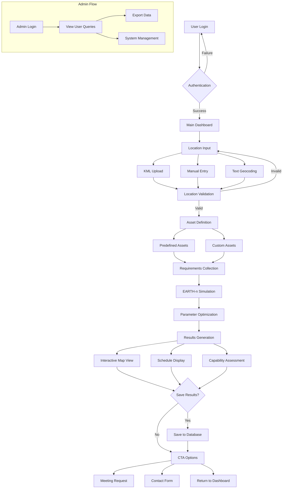
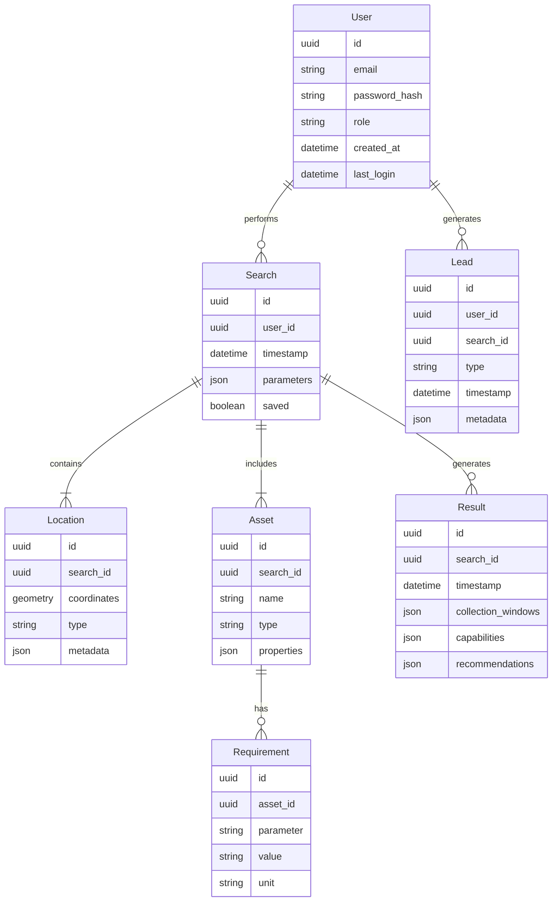
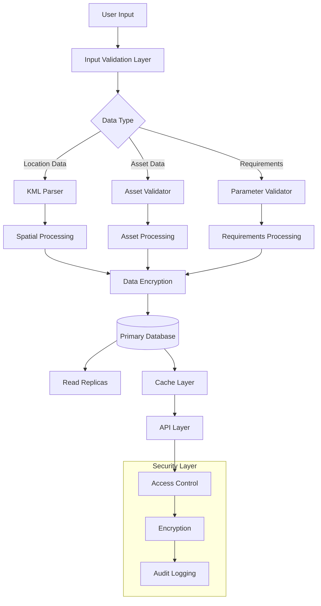
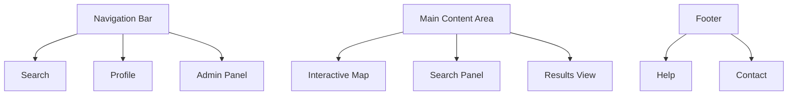

# Product Requirements Document (PRD)

# 1. INTRODUCTION

## 1.1 Purpose

This Software Requirements Specification (SRS) document provides a comprehensive description of the Matter satellite data product matching platform. It serves as the primary reference for technical teams, stakeholders, and project managers involved in the development and implementation of the system. The document details functional and non-functional requirements, system constraints, and interface specifications required to successfully deliver the web-based application.

## 1.2 Scope

The Matter satellite data product matching platform is a browser-based application that enables customers to define, visualize, and plan Earth observation requirements. The system encompasses:

- User authentication and profile management system
- Interactive mapping interface for location specification
- Asset definition and requirements collection tools
- Satellite collection planning and optimization engine
- Results visualization and reporting capabilities
- Administrative tools for system management

Key Features:
- KML file processing and validation
- Integration with EARTH-n simulator
- Real-time collection opportunity visualization
- Automated imaging parameter optimization
- Lead generation and CTA integration
- Search history management
- Multi-role user access control

Out of Scope:
- Direct satellite control or tasking
- Raw data processing or analysis
- Payment processing
- Mobile application versions
- Real-time satellite tracking

The platform will serve as the primary interface between Matter's satellite capabilities and commercial customers, environmental monitoring agencies, and organizations requiring Earth observation data.

# 2. PRODUCT DESCRIPTION

## 2.1 Product Perspective

The Matter satellite data product matching platform operates as a web-based application within Matter's broader Earth observation ecosystem. The system interfaces with:

- EARTH-n simulator for collection planning and optimization
- Matter's satellite constellation for capability parameters
- External mapping services for visualization
- Existing customer relationship management systems
- Corporate authentication services

The platform serves as the primary customer-facing interface, bridging the gap between technical satellite operations and commercial Earth observation requirements.

## 2.2 Product Functions

The platform provides the following core functions:

1. User Management
   - Account creation and authentication
   - Profile management and preferences
   - Search history tracking
   - Role-based access control

2. Location Management
   - KML file processing and validation
   - Interactive map-based location selection
   - Geocoding services
   - Area of interest definition

3. Requirements Definition
   - Asset type selection and configuration
   - Detection parameter specification
   - Collection requirement optimization
   - Custom requirement input

4. Collection Planning
   - Satellite access calculations
   - Imaging parameter optimization
   - Coverage analysis
   - Schedule generation

5. Results Management
   - Interactive visualization
   - Collection opportunity display
   - Capability assessment
   - Lead capture integration

## 2.3 User Characteristics

Primary user personas include:

1. Commercial Client
   - Technical expertise: Moderate
   - Domain knowledge: High in their specific field
   - Usage frequency: Monthly to quarterly
   - Primary goals: Define observation requirements and assess feasibility

2. Environmental Monitor
   - Technical expertise: High
   - Domain knowledge: Expert in environmental science
   - Usage frequency: Weekly
   - Primary goals: Regular monitoring and detection planning

3. System Administrator
   - Technical expertise: Expert
   - Domain knowledge: Comprehensive understanding of satellite operations
   - Usage frequency: Daily
   - Primary goals: System maintenance and user support

## 2.4 Constraints

1. Technical Constraints
   - Browser compatibility limited to modern versions of Chrome, Firefox, Safari
   - Maximum KML file size of 10MB
   - Response time requirements of <3 seconds for search operations
   - Satellite swath width limitations

2. Operational Constraints
   - Integration limited to existing EARTH-n simulator capabilities
   - Real-time satellite tasking not supported
   - Business hours support only

3. Security Constraints
   - Compliance with data protection regulations
   - Encrypted data transmission requirements
   - User data isolation requirements

## 2.5 Assumptions and Dependencies

Assumptions:
- Users have stable internet connectivity
- Modern web browser availability
- Basic understanding of Earth observation concepts
- Access to required location data

Dependencies:
- EARTH-n simulator availability and performance
- External mapping service reliability
- Authentication service uptime
- Database system performance
- Network infrastructure stability
- Third-party geocoding service availability

# 3. PROCESS FLOWCHART

# 4. FUNCTIONAL REQUIREMENTS

## 4.1 User Authentication & Management (F1)

### ID: F1
### Description
System for user registration, authentication, and profile management
### Priority
High
### Requirements

| ID | Requirement | Priority |
|---|---|---|
| F1.1 | Implement secure user registration with email verification | High |
| F1.2 | Support role-based access control (customer, admin) | High |
| F1.3 | Enable user profile management and preferences | Medium |
| F1.4 | Provide password reset functionality | High |
| F1.5 | Maintain session management and timeout controls | High |
| F1.6 | Store encrypted user credentials in database | High |

## 4.2 Location Management (F2)

### ID: F2
### Description
Tools for location input, validation, and visualization
### Priority
High
### Requirements

| ID | Requirement | Priority |
|---|---|---|
| F2.1 | Process and validate KML files up to 10MB | High |
| F2.2 | Support manual location entry via interactive map | High |
| F2.3 | Implement geocoding for text-based location input | Medium |
| F2.4 | Display locations on Mapbox-based interface | High |
| F2.5 | Validate polygon geometry and coordinate systems | High |
| F2.6 | Support area of interest definition and editing | Medium |

## 4.3 Asset Definition (F3)

### ID: F3
### Description
Interface for defining observation targets and requirements
### Priority
High
### Requirements

| ID | Requirement | Priority |
|---|---|---|
| F3.1 | Provide searchable dropdown of predefined assets | High |
| F3.2 | Support custom asset definition input | Medium |
| F3.3 | Collect asset-specific detection parameters | High |
| F3.4 | Implement dynamic requirement forms based on asset type | Medium |
| F3.5 | Validate input parameters against system capabilities | High |
| F3.6 | Store asset definitions in database | High |

## 4.4 Collection Planning (F4)

### ID: F4
### Description
Integration with EARTH-n simulator for collection optimization
### Priority
High
### Requirements

| ID | Requirement | Priority |
|---|---|---|
| F4.1 | Calculate optimal imaging parameters | High |
| F4.2 | Interface with EARTH-n simulator | High |
| F4.3 | Generate satellite access schedules | High |
| F4.4 | Handle targets exceeding swath width | Medium |
| F4.5 | Optimize collection parameters | High |
| F4.6 | Cache common simulation results | Medium |

## 4.5 Results Management (F5)

### ID: F5
### Description
Visualization and export of collection opportunities
### Priority
High
### Requirements

| ID | Requirement | Priority |
|---|---|---|
| F5.1 | Display collection opportunities on interactive map | High |
| F5.2 | Generate timeline views of access windows | High |
| F5.3 | Provide capability assessment reports | Medium |
| F5.4 | Support search result export | Medium |
| F5.5 | Save search history to database | High |
| F5.6 | Generate adjacent application recommendations | Low |

## 4.6 Lead Generation (F6)

### ID: F6
### Description
Integration of call-to-action and lead capture functionality
### Priority
Medium
### Requirements

| ID | Requirement | Priority |
|---|---|---|
| F6.1 | Display contextual CTAs after searches | High |
| F6.2 | Implement meeting request system | Medium |
| F6.3 | Provide contact form integration | High |
| F6.4 | Track CTA engagement metrics | Medium |
| F6.5 | Store lead information in database | High |
| F6.6 | Enable automated email notifications | Low |

# 5. NON-FUNCTIONAL REQUIREMENTS

## 5.1 Performance Requirements

| ID | Requirement | Target Metric |
|---|---|---|
| P1 | Map interaction latency | < 100ms |
| P2 | Search results generation time | < 3 seconds |
| P3 | KML file processing time | < 5 seconds for 10MB files |
| P4 | Maximum concurrent users | 500 |
| P5 | Database query response time | < 200ms |
| P6 | Page load time | < 2 seconds |
| P7 | API response time | < 1 second |
| P8 | Maximum memory usage per session | < 512MB |

## 5.2 Safety Requirements

| ID | Requirement | Description |
|---|---|---|
| S1 | Data backup | Automated daily backups with 30-day retention |
| S2 | Failure recovery | System state recovery within 4 hours |
| S3 | Error handling | Graceful degradation of services |
| S4 | Data validation | Input validation before processing |
| S5 | Session management | Automatic timeout after 30 minutes of inactivity |
| S6 | Transaction logging | Complete audit trail of all system operations |

## 5.3 Security Requirements

| ID | Requirement | Description |
|---|---|---|
| SE1 | Authentication | Multi-factor authentication support |
| SE2 | Authorization | Role-based access control (RBAC) |
| SE3 | Data encryption | TLS 1.3 for data in transit |
| SE4 | Database security | AES-256 encryption for sensitive data at rest |
| SE5 | API security | OAuth 2.0 implementation |
| SE6 | Password policy | Minimum 12 characters with complexity requirements |
| SE7 | Session security | HTTPS-only cookies with secure flag |
| SE8 | Audit logging | Detailed security event logging |

## 5.4 Quality Requirements

### 5.4.1 Availability
- System uptime: 99.9% excluding planned maintenance
- Planned maintenance window: Maximum 4 hours monthly
- Redundant system components for critical functions
- Automated failover capabilities

### 5.4.2 Maintainability
- Modular architecture for component isolation
- Comprehensive API documentation
- Automated deployment pipeline
- Version control for all code and configurations
- Regular system health monitoring

### 5.4.3 Usability
- Interface compliant with WCAG 2.1 Level AA
- Support for modern browsers (Chrome, Firefox, Safari)
- Maximum 3 clicks to reach any function
- Consistent UI/UX patterns throughout
- Comprehensive help documentation

### 5.4.4 Scalability
- Horizontal scaling capability for web servers
- Database sharding support
- CDN integration for static assets
- Microservices architecture support
- Auto-scaling based on load metrics

### 5.4.5 Reliability
- Mean Time Between Failures (MTBF): > 720 hours
- Mean Time To Recovery (MTTR): < 4 hours
- Error rate: < 0.1% of all transactions
- Data consistency checks
- Automated system health monitoring

## 5.5 Compliance Requirements

| ID | Requirement | Description |
|---|---|---|
| C1 | GDPR compliance | Data protection and privacy measures |
| C2 | CCPA compliance | California Consumer Privacy Act requirements |
| C3 | SOC 2 Type II | Security, availability, and confidentiality controls |
| C4 | ISO 27001 | Information security management |
| C5 | WCAG 2.1 | Web accessibility guidelines |
| C6 | Browser standards | HTML5, CSS3, ECMAScript 2021 |
| C7 | API standards | REST/OpenAPI 3.0 specification |
| C8 | Data retention | Compliance with regional data retention laws |

# 6. DATA REQUIREMENTS

## 6.1 Data Models

## 6.2 Data Storage

### 6.2.1 Primary Storage
- PostgreSQL with PostGIS extension for spatial data
- Distributed across multiple availability zones
- Automatic sharding for searches and results tables
- Read replicas for high-traffic queries

### 6.2.2 Cache Layer
- Redis cluster for:
  - Session management
  - Frequent search results
  - EARTH-n simulation cache
  - User preferences

### 6.2.3 Data Retention
- User account data: Indefinite
- Search history: 7 years
- Session data: 30 days
- Audit logs: 2 years
- Lead data: 5 years
- Cache data: 24 hours

### 6.2.4 Backup Strategy
- Full daily backups with 30-day retention
- Point-in-time recovery capability
- Cross-region backup replication
- 15-minute transaction log backups
- Monthly backup verification tests

## 6.3 Data Processing

### 6.3.1 Data Security
- AES-256 encryption for sensitive data at rest
- TLS 1.3 for data in transit
- Field-level encryption for PII
- Data masking for non-administrative users
- Automated PII detection and classification

### 6.3.2 Data Validation
- Schema validation for all inputs
- Coordinate system verification
- Asset parameter range checking
- Requirements compatibility validation
- File format and size validation

### 6.3.3 Data Transformation
- Coordinate system conversions
- KML to internal geometry format
- Requirements normalization
- Asset property standardization
- Result format optimization

### 6.3.4 Data Integration
- EARTH-n simulator data sync
- CRM system integration
- External mapping service integration
- Geocoding service integration
- Analytics platform integration

# 7. EXTERNAL INTERFACES

## 7.1 User Interfaces

### 7.1.1 Web Application Interface

| Component | Description | Requirements |
|-----------|-------------|--------------|
| Navigation | Fixed top bar with primary navigation | Responsive, always accessible |
| Map View | Mapbox-based interactive globe | Full-screen capable, zoom controls |
| Search Panel | Collapsible side panel | Drag-resizable, minimizable |
| Results Dashboard | Dynamic grid layout | Sortable columns, filterable |
| Admin Interface | Protected management console | Role-based access only |

### 7.1.2 Responsive Design Requirements

| Breakpoint | Layout Adjustments |
|------------|-------------------|
| Desktop (>1200px) | Full feature set, multi-column layout |
| Tablet (768-1199px) | Collapsed navigation, scrollable panels |
| Mobile (<767px) | Stack layout, hidden secondary features |

## 7.2 Hardware Interfaces

### 7.2.1 Server Infrastructure

| Component | Specification |
|-----------|--------------|
| Web Servers | AWS EC2 instances, auto-scaling group |
| Database Servers | AWS RDS PostgreSQL, multi-AZ |
| Cache Servers | AWS ElastiCache Redis cluster |
| Load Balancers | AWS Application Load Balancer |

### 7.2.2 Client Requirements

| Component | Minimum Specification |
|-----------|---------------------|
| CPU | Dual-core processor, 2.0GHz |
| Memory | 4GB RAM |
| Display | 1366x768 resolution |
| Network | 5Mbps stable connection |

## 7.3 Software Interfaces

### 7.3.1 External Services Integration

| Service | Interface Type | Purpose |
|---------|---------------|----------|
| EARTH-n Simulator | REST API | Collection planning |
| Mapbox | JavaScript SDK | Map visualization |
| Geocoding Service | REST API | Location resolution |
| Authentication Service | OAuth 2.0 | User authentication |

### 7.3.2 Database Interfaces

| System | Protocol | Usage |
|--------|----------|--------|
| PostgreSQL | TCP/IP | Primary data storage |
| Redis | TCP/IP | Session and cache management |
| S3 | HTTPS | File storage |

## 7.4 Communication Interfaces

### 7.4.1 Network Protocols

| Protocol | Usage | Port |
|----------|-------|------|
| HTTPS | Web application access | 443 |
| WSS | Real-time updates | 443 |
| TCP/IP | Database communication | 5432 |

### 7.4.2 API Specifications

| Endpoint Type | Format | Authentication |
|---------------|--------|----------------|
| REST APIs | JSON | JWT tokens |
| WebSocket | JSON | Socket tokens |
| Internal APIs | Protocol Buffers | Service tokens |

### 7.4.3 Data Exchange Formats

| Format | Usage |
|--------|-------|
| JSON | API responses |
| KML | Location data |
| GeoJSON | Spatial data |
| CSV | Data exports |

# 8. APPENDICES

## 8.1 GLOSSARY

| Term | Definition |
|------|------------|
| Area of Interest | Geographic region specified by user for satellite observation |
| Asset | Physical object or phenomenon to be detected/monitored by satellite |
| Collection Window | Time period during which satellite imaging is possible |
| Detection Parameter | Specific measurement requirements for observing an asset |
| Imaging Mode | Specific configuration of satellite sensors for data collection |
| Lead | Potential customer showing interest through platform interaction |
| Swath Width | Width of area that can be imaged in a single satellite pass |
| Target | Specific location or object designated for observation |

## 8.2 ACRONYMS

| Acronym | Definition |
|---------|------------|
| API | Application Programming Interface |
| AWS | Amazon Web Services |
| CDN | Content Delivery Network |
| CRM | Customer Relationship Management |
| CTA | Call To Action |
| EC2 | Elastic Compute Cloud |
| GDPR | General Data Protection Regulation |
| JWT | JSON Web Token |
| KML | Keyhole Markup Language |
| MDL | Minimum Detection Limit |
| PII | Personally Identifiable Information |
| RBAC | Role-Based Access Control |
| RDS | Relational Database Service |
| REST | Representational State Transfer |
| TLS | Transport Layer Security |
| UI/UX | User Interface/User Experience |
| UUID | Universally Unique Identifier |
| WCAG | Web Content Accessibility Guidelines |
| WSS | WebSocket Secure |

## 8.3 ADDITIONAL REFERENCES

| Reference | Description | URL |
|-----------|-------------|-----|
| Mapbox GL JS Documentation | Interactive mapping library documentation | https://docs.mapbox.com/mapbox-gl-js/ |
| OpenAPI Specification | REST API documentation standard | https://swagger.io/specification/ |
| PostGIS Documentation | Spatial database extension documentation | https://postgis.net/documentation/ |
| Redis Documentation | In-memory data structure store | https://redis.io/documentation |
| OAuth 2.0 Specification | Authorization framework specification | https://oauth.net/2/ |
| WCAG 2.1 Guidelines | Web accessibility standards | https://www.w3.org/WAI/WCAG21/Understanding/ |
| KML Reference | KML file format specification | https://developers.google.com/kml/documentation/ |
| GeoJSON Specification | Geographic data format standard | https://geojson.org/ |