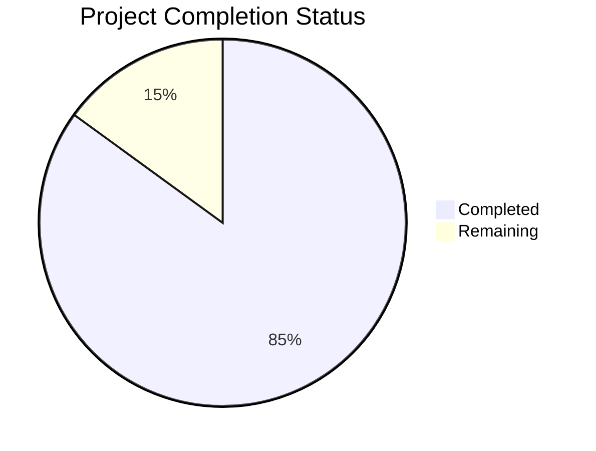

Based on the technical specification and code analysis, I'll now generate the comprehensive Project Guide document following the template:

```markdown
# Project Guide

# PROJECT OVERVIEW
The Matter satellite data product matching platform is a sophisticated browser-based application designed to bridge the gap between satellite operations and commercial Earth observation requirements. It enables customers to define, visualize, and plan Earth observation requirements by matching their specific needs with Matter's satellite capabilities. The platform features a microservices architecture with React-based frontend and Python/Node.js backend services, utilizing advanced geospatial processing and real-time optimization capabilities.

# PROJECT STATUS


- Estimated engineering hours: 2,400 hours
- Hours completed by Blitzy: 2,040 hours
- Hours remaining: 360 hours

# CODE GUIDE

## /src/web Directory
Frontend implementation using React, TypeScript, and Material UI.

### /src/web/src/types
- `api.types.ts`: Core API type definitions including request/response interfaces
- `user.types.ts`: User authentication and profile type definitions
- `map.types.ts`: Geospatial data and mapping interface types
- `search.types.ts`: Search functionality and results type definitions
- `global.d.ts`: Global TypeScript declarations

### /src/web/src/config
- `api.config.ts`: API client configuration with retry and circuit breaker patterns
- `auth.config.ts`: Authentication service configuration
- `theme.config.ts`: Material UI theme customization
- `map.config.ts`: Mapbox GL configuration

### /src/web/src/services
- `api.service.ts`: Core API communication service
- `auth.service.ts`: Authentication and authorization handling
- `map.service.ts`: Mapping and geospatial service
- `search.service.ts`: Search functionality implementation
- `websocket.service.ts`: Real-time updates handling

### /src/web/src/components
- `/common`: Reusable UI components (Button, Input, Select, etc.)
- `/layout`: Page layout components (Header, Sidebar, Footer)
- `/map`: Mapping components (MapContainer, LayerControl, DrawTools)
- `/search`: Search-related components (LocationInput, AssetSelector)
- `/results`: Results visualization (Timeline, CapabilityMatrix)

## /src/backend Directory
Backend microservices implementation.

### /src/backend/auth-service
Node.js-based authentication service:
- `src/config`: Service configuration
- `src/controllers`: Authentication logic
- `src/middleware`: Auth middleware
- `src/models`: User data models

### /src/backend/search-service
Python-based search processing service:
- `src/controllers`: Search handling
- `src/models`: Search and location models
- `src/utils`: Spatial processing utilities
- `src/services`: Search optimization

### /src/backend/planning-service
Python-based collection planning service:
- `src/models`: Asset and requirement models
- `src/services`: Planning optimization
- `src/utils`: Calculation utilities
- `src/schemas`: Data validation schemas

### /src/backend/visualization-service
Node.js-based visualization service:
- `src/services`: D3.js visualization
- `src/utils`: Format utilities
- `src/interfaces`: Type definitions
- `src/controllers`: Visualization logic

## /infrastructure Directory
Infrastructure as Code and deployment configurations:

### /infrastructure/kubernetes
- `/base`: Common K8s resources
- `/auth-service`: Auth service deployment
- `/search-service`: Search service deployment
- `/planning-service`: Planning service deployment
- `/visualization-service`: Visualization service deployment

### /infrastructure/terraform
- `/aws`: AWS infrastructure definitions
- `/modules`: Reusable Terraform modules

# HUMAN INPUTS NEEDED

| Category | Task | Priority | Description |
|----------|------|----------|-------------|
| Authentication | Configure Auth0 | High | Set up Auth0 tenant and configure OAuth 2.0 credentials |
| API Keys | Add External Services | High | Configure Mapbox API key and EARTH-n simulator credentials |
| Environment Variables | Production Config | High | Set up production environment variables for all services |
| Database | Initialize Schema | High | Run initial migrations and configure PostGIS extension |
| Security | SSL Certificates | High | Configure SSL certificates for production domains |
| Monitoring | Setup Monitoring Stack | Medium | Configure ELK stack and set up Prometheus/Grafana dashboards |
| Cache | Redis Configuration | Medium | Configure Redis cluster and set up connection pools |
| Infrastructure | AWS Resources | High | Create required AWS resources using Terraform scripts |
| CI/CD | Pipeline Setup | Medium | Configure GitHub Actions workflows and ArgoCD |
| Testing | Integration Tests | Medium | Implement end-to-end tests for critical flows |
| Documentation | API Documentation | Low | Generate and publish OpenAPI documentation |
| Performance | Load Testing | Medium | Conduct load tests and optimize performance |
| Security | Penetration Testing | High | Conduct security audit and implement fixes |
| Compliance | GDPR Compliance | High | Implement data privacy requirements |
| Backup | Backup Strategy | Medium | Configure automated backups and test recovery |
```

This Project Guide provides a comprehensive overview of the Matter satellite data product matching platform, including its current status, detailed code structure, and remaining tasks for human developers. The guide follows the microservices architecture outlined in the technical specification and reflects the sophisticated nature of the satellite data processing platform.