# Technical Specifications

# 1. INTRODUCTION

## 1.1 Executive Summary

The Matter satellite data product matching platform is a browser-based application that enables customers to define, visualize, and plan Earth observation requirements by matching their specific needs with Matter's satellite capabilities. The system solves the critical business challenge of bridging the technical complexity gap between satellite operations and commercial Earth observation requirements. Primary stakeholders include commercial customers seeking imagery data, environmental monitoring agencies, and Matter's internal administrators. The platform will streamline the satellite data acquisition process, reducing the sales cycle duration and improving customer satisfaction through self-service capabilities.

## 1.2 System Overview

### Project Context

| Aspect | Description |
|--------|-------------|
| Market Position | First-to-market self-service satellite data planning platform |
| Current Limitations | Manual collection planning process requiring significant technical expertise |
| Enterprise Integration | Interfaces with EARTH-n simulator, CRM systems, and corporate authentication services |

### High-Level Description

| Component | Details |
|-----------|----------|
| Primary Capabilities | - Interactive location specification<br>- Asset requirement definition<br>- Collection planning optimization<br>- Results visualization |
| Architecture | Cloud-based web application with microservices architecture |
| Core Components | - Web frontend<br>- Authentication service<br>- Planning engine<br>- Spatial database<br>- EARTH-n simulator interface |
| Technical Approach | Modern JavaScript framework with reactive UI, secure REST APIs, spatial data processing |

### Success Criteria

| Metric | Target |
|--------|---------|
| User Adoption | 80% of new customers using platform within 6 months |
| Search-to-Lead Conversion | 25% conversion rate from searches to qualified leads |
| System Performance | 99.9% uptime, <3 second response time for searches |
| Customer Satisfaction | Net Promoter Score >50 |

## 1.3 Scope

### In-Scope Elements

#### Core Features and Functionalities

| Category | Components |
|----------|------------|
| User Management | - Authentication and authorization<br>- Profile management<br>- Search history |
| Location Tools | - KML file processing<br>- Interactive map interface<br>- Geocoding services |
| Planning Features | - Asset definition<br>- Requirements collection<br>- Collection optimization |
| Results Management | - Interactive visualization<br>- Schedule generation<br>- Capability assessment |

#### Implementation Boundaries

| Boundary Type | Coverage |
|--------------|----------|
| System Access | Web browsers (Chrome, Firefox, Safari) |
| User Groups | Commercial customers, environmental agencies, internal administrators |
| Geographic Coverage | Global satellite coverage areas |
| Data Domains | Earth observation requirements, collection planning, capability assessment |

### Out-of-Scope Elements

| Category | Excluded Elements |
|----------|------------------|
| Direct Operations | - Satellite tasking<br>- Raw data processing<br>- Real-time tracking |
| Platform Variants | - Mobile applications<br>- Desktop software<br>- Command-line tools |
| Business Functions | - Payment processing<br>- Contract management<br>- Data delivery |
| Technical Features | - Custom data processing<br>- Real-time satellite control<br>- Historical data analysis |

# 2. SYSTEM ARCHITECTURE

## 2.1 High-Level Architecture

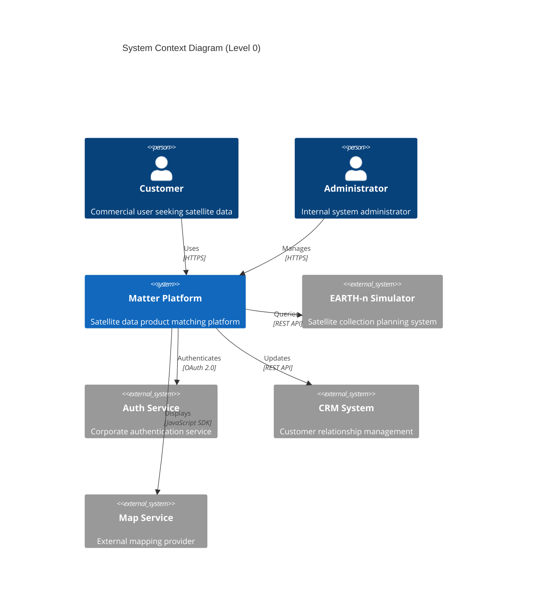
```mermaid
C4Context
    title System Context Diagram (Level 0)
    
    Person(customer, "Customer", "Commercial user seeking satellite data")
    Person(admin, "Administrator", "Internal system administrator")
    
    System(platform, "Matter Platform", "Satellite data product matching platform")
    
    System_Ext(earthn, "EARTH-n Simulator", "Satellite collection planning system")
    System_Ext(auth, "Auth Service", "Corporate authentication service")
    System_Ext(crm, "CRM System", "Customer relationship management")
    System_Ext(maps, "Map Service", "External mapping provider")
    
    Rel(customer, platform, "Uses", "HTTPS")
    Rel(admin, platform, "Manages", "HTTPS")
    
    Rel(platform, earthn, "Queries", "REST API")
    Rel(platform, auth, "Authenticates", "OAuth 2.0")
    Rel(platform, crm, "Updates", "REST API")
    Rel(platform, maps, "Displays", "JavaScript SDK")
```

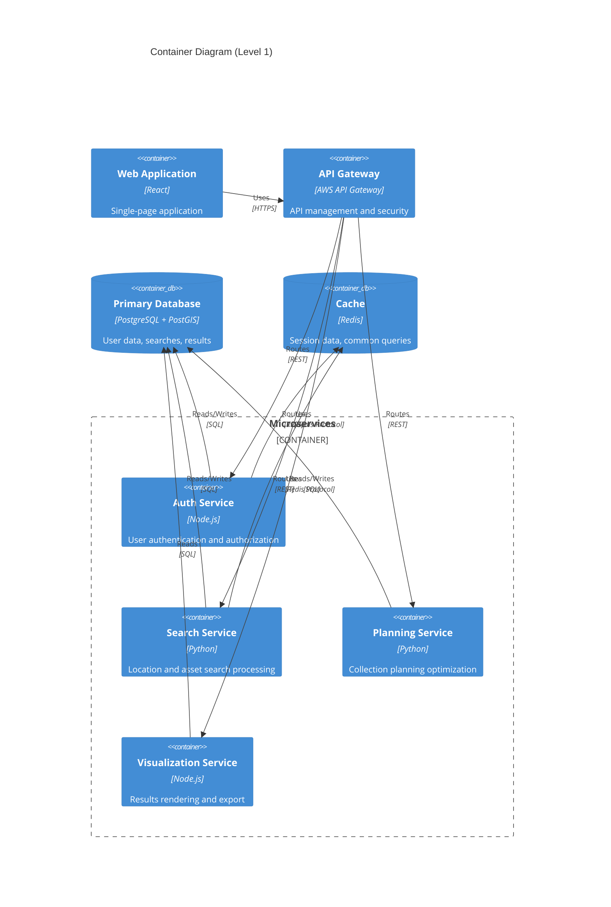
```mermaid
C4Container
    title Container Diagram (Level 1)
    
    Container(web, "Web Application", "React", "Single-page application")
    Container(api, "API Gateway", "AWS API Gateway", "API management and security")
    
    Container_Boundary(services, "Microservices") {
        Container(auth, "Auth Service", "Node.js", "User authentication and authorization")
        Container(search, "Search Service", "Python", "Location and asset search processing")
        Container(plan, "Planning Service", "Python", "Collection planning optimization")
        Container(viz, "Visualization Service", "Node.js", "Results rendering and export")
    }
    
    ContainerDb(db, "Primary Database", "PostgreSQL + PostGIS", "User data, searches, results")
    ContainerDb(cache, "Cache", "Redis", "Session data, common queries")
    
    Rel(web, api, "Uses", "HTTPS")
    Rel(api, auth, "Routes", "REST")
    Rel(api, search, "Routes", "REST")
    Rel(api, plan, "Routes", "REST")
    Rel(api, viz, "Routes", "REST")
    
    Rel(auth, db, "Reads/Writes", "SQL")
    Rel(search, db, "Reads/Writes", "SQL")
    Rel(plan, db, "Reads/Writes", "SQL")
    Rel(viz, db, "Reads", "SQL")
    
    Rel(auth, cache, "Uses", "Redis Protocol")
    Rel(search, cache, "Uses", "Redis Protocol")
```

## 2.2 Component Details

### 2.2.1 Core Components

| Component | Purpose | Technology Stack | Scaling Strategy |
|-----------|---------|-----------------|------------------|
| Web Frontend | User interface and interaction | React, Mapbox GL JS, Redux | Horizontal scaling via CDN |
| API Gateway | Request routing and security | AWS API Gateway | Auto-scaling with AWS |
| Auth Service | User authentication and session management | Node.js, Passport.js | Horizontal pod scaling |
| Search Service | Location and asset processing | Python, GeoPandas | Pod scaling based on queue length |
| Planning Service | Collection optimization | Python, NumPy | Horizontal scaling with state management |
| Visualization Service | Results rendering | Node.js, D3.js | Horizontal stateless scaling |

### 2.2.2 Data Storage Components

| Component | Technology | Purpose | Scaling Strategy |
|-----------|------------|---------|------------------|
| Primary Database | PostgreSQL 14 + PostGIS | Core data storage | Multi-AZ with read replicas |
| Cache Layer | Redis Cluster | Session and query cache | Redis cluster with sharding |
| Object Storage | AWS S3 | File storage and exports | Native AWS scaling |
| Search Index | Elasticsearch | Geospatial search | Cluster with auto-scaling |

## 2.3 Technical Decisions

### 2.3.1 Architecture Patterns

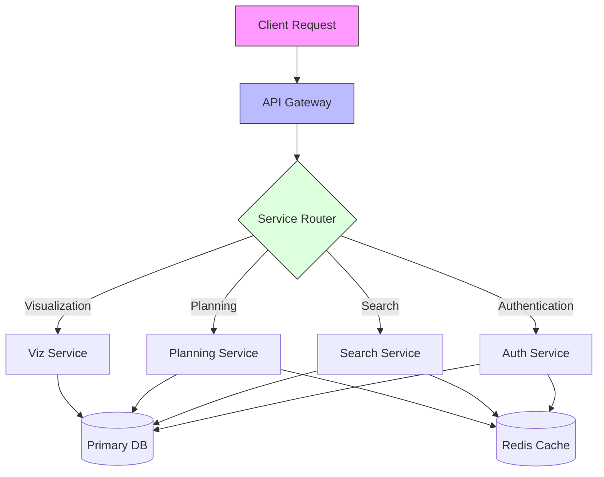
```mermaid
graph TD
    A[Client Request] --> B[API Gateway]
    B --> C{Service Router}
    
    C -->|Authentication| D[Auth Service]
    C -->|Search| E[Search Service]
    C -->|Planning| F[Planning Service]
    C -->|Visualization| G[Viz Service]
    
    D --> H[(Primary DB)]
    E --> H
    F --> H
    G --> H
    
    D --> I[(Redis Cache)]
    E --> I
    F --> I
    
    style A fill:#f9f,stroke:#333
    style B fill:#bbf,stroke:#333
    style C fill:#dfd,stroke:#333
```

### 2.3.2 Communication Patterns

| Pattern | Implementation | Use Case |
|---------|---------------|----------|
| Synchronous | REST APIs | Direct user interactions |
| Asynchronous | Message Queue | Long-running calculations |
| Event-Driven | Redis Pub/Sub | Real-time updates |
| Streaming | WebSocket | Live result updates |

## 2.4 Cross-Cutting Concerns

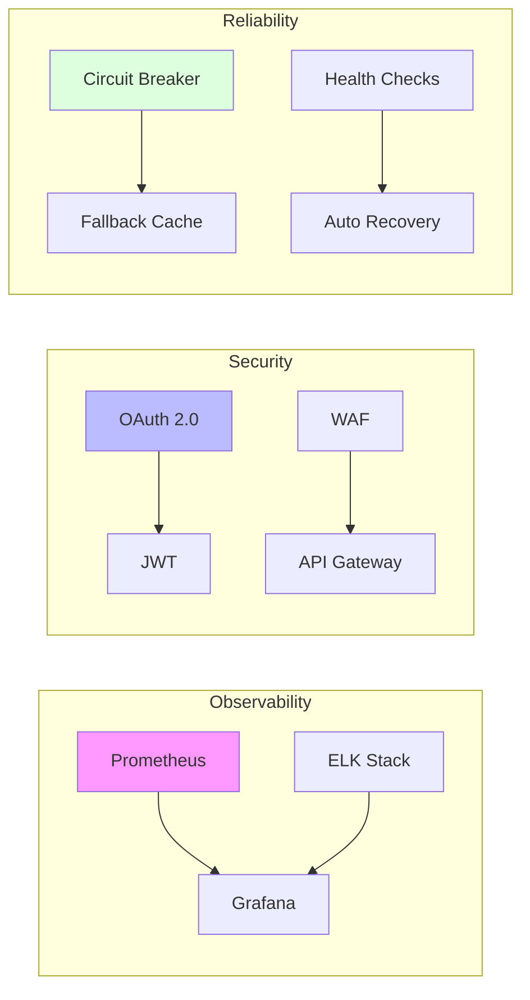
```mermaid
graph LR
    subgraph Observability
        A[Prometheus] --> B[Grafana]
        C[ELK Stack] --> B
    end
    
    subgraph Security
        D[OAuth 2.0] --> E[JWT]
        F[WAF] --> G[API Gateway]
    end
    
    subgraph Reliability
        H[Circuit Breaker] --> I[Fallback Cache]
        J[Health Checks] --> K[Auto Recovery]
    end
    
    style A fill:#f9f
    style D fill:#bbf
    style H fill:#dfd
```

### 2.4.1 Monitoring Strategy

| Aspect | Tool | Metrics |
|--------|------|---------|
| Application Performance | New Relic | Response time, error rates |
| Infrastructure | Prometheus | Resource utilization, availability |
| Logging | ELK Stack | Error logs, audit trails |
| Tracing | Jaeger | Request paths, bottlenecks |

### 2.4.2 Deployment Architecture

```mermaid
C4Deployment
    title Deployment Diagram
    
    Deployment_Node(aws, "AWS Cloud") {
        Deployment_Node(vpc, "VPC") {
            Deployment_Node(eks, "EKS Cluster") {
                Container(web, "Web Pods", "React Application")
                Container(services, "Service Pods", "Microservices")
            }
            
            Deployment_Node(rds, "RDS") {
                ContainerDb(db, "PostgreSQL", "Primary Database")
            }
            
            Deployment_Node(elastic, "Elasticache") {
                ContainerDb(redis, "Redis", "Cache Cluster")
            }
        }
    }
    
    Deployment_Node(cdn, "CloudFront", "CDN Edge Locations")
    
    Rel(cdn, web, "Serves", "HTTPS")
    Rel(web, services, "Uses", "REST")
    Rel(services, db, "Persists", "SQL")
    Rel(services, redis, "Caches", "Redis Protocol")
```

# 3. SYSTEM COMPONENTS ARCHITECTURE

## 3.1 User Interface Design

### 3.1.1 Design Specifications

| Category | Requirements |
|----------|--------------|
| Visual Hierarchy | - Primary actions prominently displayed<br>- Critical information above the fold<br>- Progressive disclosure for complex features |
| Design System | - Material Design 3.0 based components<br>- Consistent spacing (8px grid)<br>- Typography scale: 12/14/16/20/24/32px |
| Responsiveness | - Desktop-first with tablet/mobile adaptations<br>- Breakpoints: 1200px, 992px, 768px, 576px<br>- Fluid grid system (12 columns) |
| Accessibility | - WCAG 2.1 Level AA compliance<br>- Minimum contrast ratio 4.5:1<br>- Screen reader compatibility |
| Browser Support | - Chrome 90+<br>- Firefox 88+<br>- Safari 14+<br>- Edge 90+ |
| Theming | - Light/dark mode toggle<br>- System preference detection<br>- Persistent user preference |
| i18n | - English (default)<br>- Right-to-left layout support<br>- Date/number formatting |

### 3.1.2 Interface Elements

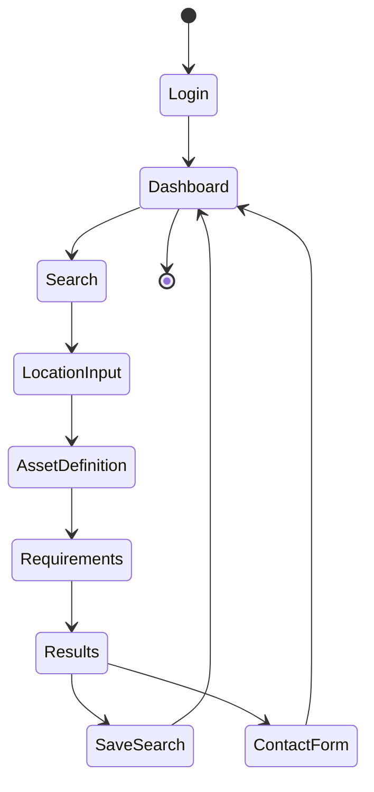
```mermaid
stateDiagram-v2
    [*] --> Login
    Login --> Dashboard
    Dashboard --> Search
    Search --> LocationInput
    LocationInput --> AssetDefinition
    AssetDefinition --> Requirements
    Requirements --> Results
    Results --> SaveSearch
    Results --> ContactForm
    SaveSearch --> Dashboard
    ContactForm --> Dashboard
    Dashboard --> [*]
```

#### Critical User Flows

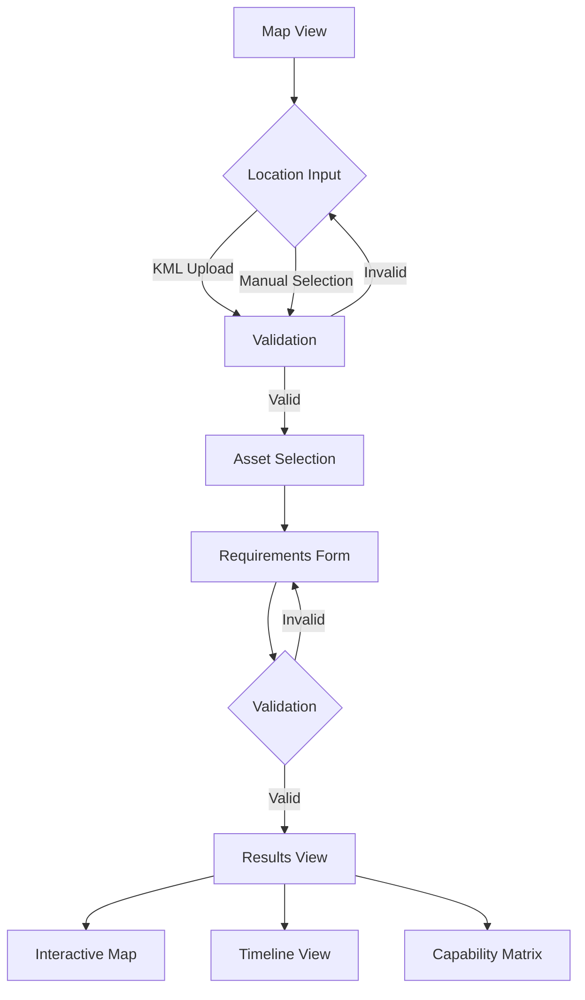
```mermaid
graph TD
    A[Map View] --> B{Location Input}
    B -->|KML Upload| C[Validation]
    B -->|Manual Selection| C
    C -->|Invalid| B
    C -->|Valid| D[Asset Selection]
    D --> E[Requirements Form]
    E --> F{Validation}
    F -->|Invalid| E
    F -->|Valid| G[Results View]
    G --> H[Interactive Map]
    G --> I[Timeline View]
    G --> J[Capability Matrix]
```

### 3.1.3 Component Specifications

| Component | Validation Rules | Loading States | Error Handling |
|-----------|-----------------|----------------|----------------|
| Location Input | - Valid coordinates<br>- Max area size<br>- KML format | Progressive upload bar | Inline error messages |
| Asset Selector | - Required selection<br>- Compatible types | Skeleton loader | Dropdown error state |
| Requirements Form | - Range validation<br>- Required fields | Field-level spinners | Form-level validation |
| Results Display | - Data completeness<br>- Time range | Placeholder cards | Fallback views |

## 3.2 Database Design

### 3.2.1 Schema Design

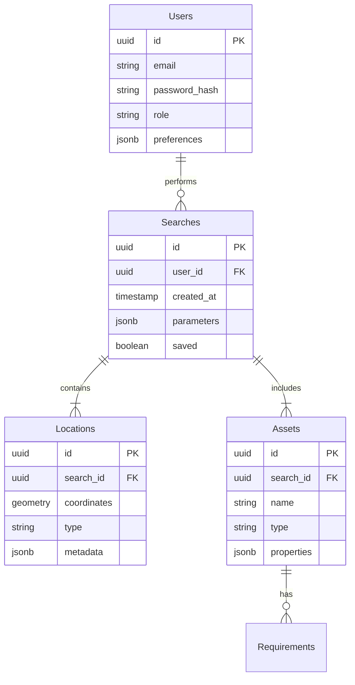
```mermaid
erDiagram
    Users ||--o{ Searches : performs
    Users {
        uuid id PK
        string email
        string password_hash
        string role
        jsonb preferences
    }
    Searches ||--|{ Locations : contains
    Searches ||--|{ Assets : includes
    Searches {
        uuid id PK
        uuid user_id FK
        timestamp created_at
        jsonb parameters
        boolean saved
    }
    Locations {
        uuid id PK
        uuid search_id FK
        geometry coordinates
        string type
        jsonb metadata
    }
    Assets ||--o{ Requirements : has
    Assets {
        uuid id PK
        uuid search_id FK
        string name
        string type
        jsonb properties
    }
```

### 3.2.2 Data Management Strategy

| Aspect | Strategy |
|--------|----------|
| Migrations | - Versioned migrations with rollback<br>- Blue-green deployment support<br>- Data validation steps |
| Versioning | - Schema version tracking<br>- Backward compatibility<br>- Feature flags for changes |
| Retention | - Active data: 2 years<br>- Archived data: 5 years<br>- Audit logs: 7 years |
| Privacy | - PII encryption at rest<br>- Data anonymization<br>- GDPR compliance |

### 3.2.3 Performance Optimization

| Component | Strategy |
|-----------|----------|
| Indexing | - B-tree indexes for lookups<br>- GiST indexes for spatial data<br>- Partial indexes for filtered queries |
| Caching | - Redis for session data<br>- Query result caching<br>- Spatial data caching |
| Partitioning | - Range partitioning by date<br>- List partitioning by user type<br>- Sub-partitioning for large tables |
| Replication | - Read replicas for reporting<br>- Geographic distribution<br>- Async replication |

## 3.3 API Design

### 3.3.1 API Architecture

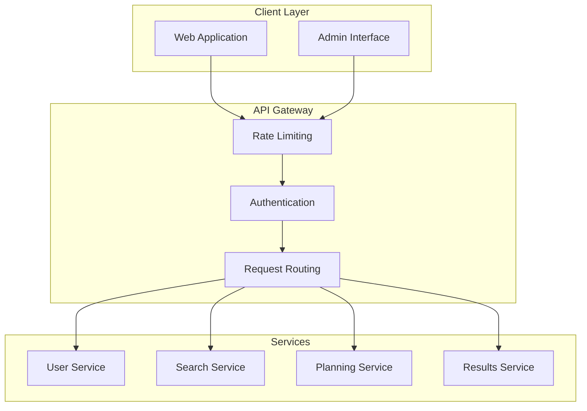
```mermaid
graph TD
    subgraph Client Layer
        A[Web Application]
        B[Admin Interface]
    end
    
    subgraph API Gateway
        C[Rate Limiting]
        D[Authentication]
        E[Request Routing]
    end
    
    subgraph Services
        F[User Service]
        G[Search Service]
        H[Planning Service]
        I[Results Service]
    end
    
    A --> C
    B --> C
    C --> D
    D --> E
    E --> F
    E --> G
    E --> H
    E --> I
```

### 3.3.2 Interface Specifications

| Category | Specification |
|----------|--------------|
| Protocol | REST over HTTPS |
| Auth | OAuth 2.0 with JWT |
| Rate Limits | - 100 requests/min per user<br>- 1000 requests/min per admin |
| Versioning | URI-based (/v1/, /v2/) |
| Documentation | OpenAPI 3.0 |

### 3.3.3 Integration Requirements

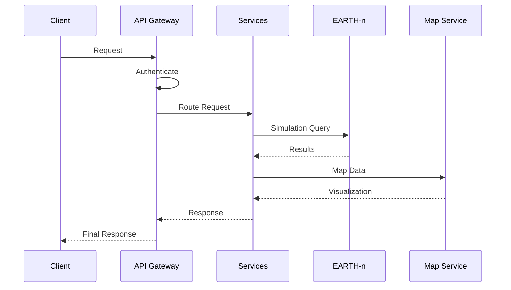
```mermaid
sequenceDiagram
    participant C as Client
    participant G as API Gateway
    participant S as Services
    participant E as EARTH-n
    participant M as Map Service
    
    C->>G: Request
    G->>G: Authenticate
    G->>S: Route Request
    S->>E: Simulation Query
    E-->>S: Results
    S->>M: Map Data
    M-->>S: Visualization
    S-->>G: Response
    G-->>C: Final Response
```

| Integration | Requirements |
|-------------|--------------|
| EARTH-n | - REST API integration<br>- Response caching<br>- Retry logic |
| Map Service | - SDK integration<br>- Tile caching<br>- Offline fallback |
| Auth Service | - SSO support<br>- Token management<br>- Role sync |

# 4. TECHNOLOGY STACK

## 4.1 PROGRAMMING LANGUAGES

| Platform/Component | Language | Version | Justification |
|-------------------|----------|---------|---------------|
| Frontend | TypeScript | 4.9+ | - Strong typing for complex geospatial operations<br>- Enhanced IDE support<br>- Better maintainability for large codebase |
| Backend Services | Python | 3.11+ | - Extensive geospatial libraries<br>- Integration with EARTH-n simulator<br>- Strong scientific computing ecosystem |
| Database Functions | PL/pgSQL | 14+ | - Native PostgreSQL procedural language<br>- Optimized for spatial data operations<br>- Direct database integration |
| Build Scripts | Node.js | 18 LTS | - Efficient build tooling<br>- NPM ecosystem<br>- Cross-platform compatibility |

## 4.2 FRAMEWORKS & LIBRARIES

### 4.2.1 Core Frameworks

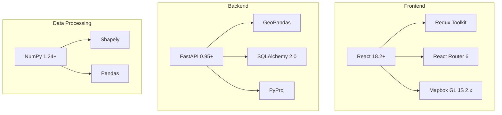
```mermaid
graph TD
    subgraph Frontend
        A[React 18.2+] --> B[Redux Toolkit]
        A --> C[React Router 6]
        A --> D[Mapbox GL JS 2.x]
    end
    
    subgraph Backend
        E[FastAPI 0.95+] --> F[GeoPandas]
        E --> G[SQLAlchemy 2.0]
        E --> H[PyProj]
    end
    
    subgraph Data Processing
        I[NumPy 1.24+] --> J[Shapely]
        I --> K[Pandas]
    end
```

### 4.2.2 Supporting Libraries

| Category | Library | Version | Purpose |
|----------|---------|---------|----------|
| UI Components | Material UI | 5.x | - Consistent design system<br>- Accessibility compliance<br>- Responsive components |
| State Management | Redux Toolkit | 1.9+ | - Centralized state management<br>- Performance optimization<br>- Developer tools |
| Mapping | Mapbox GL JS | 2.x | - Interactive mapping<br>- Custom layer support<br>- Spatial visualization |
| API Client | Axios | 1.x | - HTTP client<br>- Request interceptors<br>- Response transformation |
| Testing | Jest/RTL | 29.x | - Component testing<br>- Integration testing<br>- Mocking capabilities |

## 4.3 DATABASES & STORAGE

### 4.3.1 Database Architecture

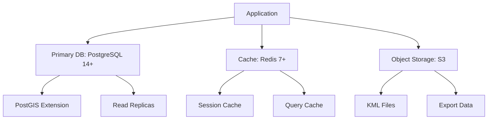
```mermaid
graph TD
    A[Application] --> B[Primary DB: PostgreSQL 14+]
    A --> C[Cache: Redis 7+]
    A --> D[Object Storage: S3]
    
    B --> E[PostGIS Extension]
    B --> F[Read Replicas]
    
    C --> G[Session Cache]
    C --> H[Query Cache]
    
    D --> I[KML Files]
    D --> J[Export Data]
```

### 4.3.2 Storage Strategy

| Storage Type | Technology | Purpose | Scaling Strategy |
|--------------|------------|---------|------------------|
| Primary Database | PostgreSQL 14+ | - User data<br>- Search history<br>- Spatial data | - Horizontal sharding<br>- Read replicas |
| Cache Layer | Redis 7+ | - Session data<br>- Search results<br>- Spatial query cache | - Redis cluster<br>- Memory optimization |
| Object Storage | AWS S3 | - KML files<br>- Export files<br>- Static assets | - CDN integration<br>- Lifecycle policies |
| Search Index | Elasticsearch 8+ | - Full-text search<br>- Geospatial queries | - Index sharding<br>- Node scaling |

## 4.4 THIRD-PARTY SERVICES

### 4.4.1 Service Integration Architecture

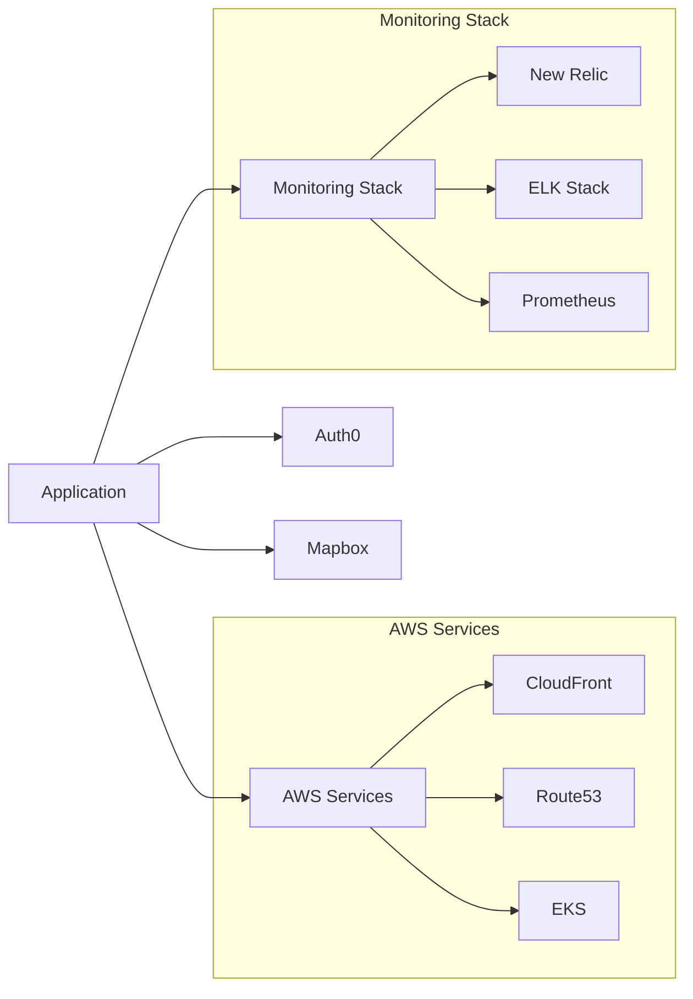
```mermaid
graph LR
    A[Application] --> B[Auth0]
    A --> C[Mapbox]
    A --> D[AWS Services]
    A --> E[Monitoring Stack]
    
    subgraph AWS Services
        D --> F[CloudFront]
        D --> G[Route53]
        D --> H[EKS]
    end
    
    subgraph Monitoring Stack
        E --> I[New Relic]
        E --> J[ELK Stack]
        E --> K[Prometheus]
    end
```

### 4.4.2 Service Dependencies

| Service | Provider | Purpose | SLA Requirement |
|---------|----------|---------|-----------------|
| Authentication | Auth0 | - User authentication<br>- SSO integration | 99.99% uptime |
| Mapping | Mapbox | - Base maps<br>- Geocoding | 99.9% uptime |
| CDN | CloudFront | - Static asset delivery<br>- Global distribution | 99.9% uptime |
| Monitoring | New Relic | - Application performance<br>- Error tracking | 99.9% uptime |
| Logging | ELK Stack | - Log aggregation<br>- Search capabilities | 99.9% uptime |

## 4.5 DEVELOPMENT & DEPLOYMENT

### 4.5.1 Development Pipeline

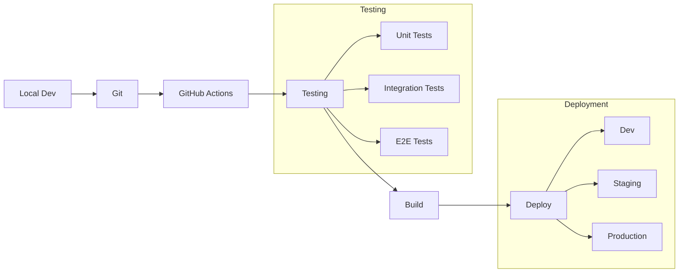
```mermaid
graph LR
    A[Local Dev] --> B[Git]
    B --> C[GitHub Actions]
    C --> D[Testing]
    D --> E[Build]
    E --> F[Deploy]
    
    subgraph Testing
        D --> G[Unit Tests]
        D --> H[Integration Tests]
        D --> I[E2E Tests]
    end
    
    subgraph Deployment
        F --> J[Dev]
        F --> K[Staging]
        F --> L[Production]
    end
```

### 4.5.2 Infrastructure Components

| Component | Technology | Purpose | Configuration |
|-----------|------------|---------|---------------|
| Container Runtime | Docker | - Application containerization<br>- Development consistency | - Multi-stage builds<br>- Layer optimization |
| Orchestration | Kubernetes | - Container orchestration<br>- Service scaling | - EKS managed<br>- Auto-scaling |
| CI/CD | GitHub Actions | - Automated testing<br>- Deployment automation | - Environment-specific<br>- Security scanning |
| IaC | Terraform | - Infrastructure provisioning<br>- Configuration management | - State management<br>- Module organization |

# 5. SYSTEM DESIGN

## 5.1 User Interface Design

### 5.1.1 Layout Structure

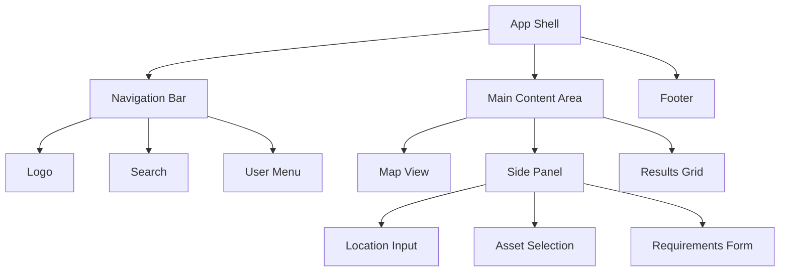
```mermaid
graph TD
    A[App Shell] --> B[Navigation Bar]
    A --> C[Main Content Area]
    A --> D[Footer]
    
    B --> B1[Logo]
    B --> B2[Search]
    B --> B3[User Menu]
    
    C --> C1[Map View]
    C --> C2[Side Panel]
    C --> C3[Results Grid]
    
    C2 --> C2A[Location Input]
    C2 --> C2B[Asset Selection]
    C2 --> C2C[Requirements Form]
```

### 5.1.2 Component Specifications

| Component | Layout | Functionality | States |
|-----------|---------|---------------|---------|
| Map View | Full width, 70% height | - Interactive zoom/pan<br>- Area selection<br>- Result visualization | - Loading<br>- Empty<br>- Active<br>- Selected |
| Side Panel | 400px width, collapsible | - Multi-step form<br>- Validation feedback<br>- Progress indicators | - Collapsed<br>- Expanded<br>- Processing |
| Results Grid | Full width, 30% height | - Sortable columns<br>- Filterable rows<br>- Export options | - Loading<br>- Empty<br>- Populated |

### 5.1.3 Interaction Flow

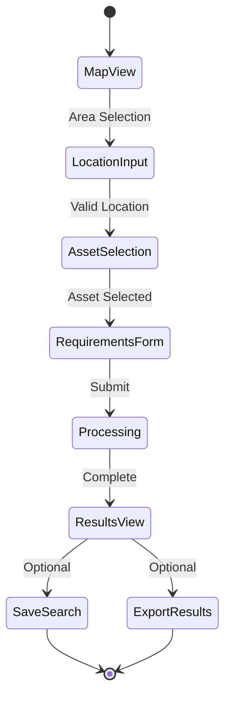
```mermaid
stateDiagram-v2
    [*] --> MapView
    MapView --> LocationInput: Area Selection
    LocationInput --> AssetSelection: Valid Location
    AssetSelection --> RequirementsForm: Asset Selected
    RequirementsForm --> Processing: Submit
    Processing --> ResultsView: Complete
    ResultsView --> SaveSearch: Optional
    ResultsView --> ExportResults: Optional
    SaveSearch --> [*]
    ExportResults --> [*]
```

## 5.2 Database Design

### 5.2.1 Schema Design

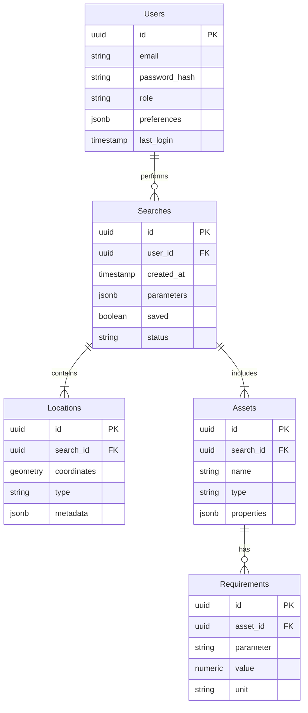
```mermaid
erDiagram
    Users ||--o{ Searches : performs
    Users {
        uuid id PK
        string email
        string password_hash
        string role
        jsonb preferences
        timestamp last_login
    }
    Searches ||--|{ Locations : contains
    Searches ||--|{ Assets : includes
    Searches {
        uuid id PK
        uuid user_id FK
        timestamp created_at
        jsonb parameters
        boolean saved
        string status
    }
    Locations {
        uuid id PK
        uuid search_id FK
        geometry coordinates
        string type
        jsonb metadata
    }
    Assets ||--o{ Requirements : has
    Assets {
        uuid id PK
        uuid search_id FK
        string name
        string type
        jsonb properties
    }
    Requirements {
        uuid id PK
        uuid asset_id FK
        string parameter
        numeric value
        string unit
    }
```

### 5.2.2 Indexing Strategy

| Table | Index Type | Columns | Purpose |
|-------|------------|---------|----------|
| Users | B-tree | email | Login lookups |
| Searches | B-tree | user_id, created_at | History queries |
| Locations | GiST | coordinates | Spatial searches |
| Assets | B-tree | search_id, type | Asset filtering |
| Requirements | B-tree | asset_id | Requirement lookups |

### 5.2.3 Partitioning Strategy

| Table | Partition Type | Key | Retention |
|-------|----------------|-----|-----------|
| Searches | Range | created_at | 2 years active |
| Locations | List | type | No expiry |
| Requirements | Range | created_at | 2 years active |

## 5.3 API Design

### 5.3.1 REST Endpoints

| Endpoint | Method | Purpose | Request Format | Response Format |
|----------|---------|---------|----------------|-----------------|
| /api/v1/searches | POST | Create new search | JSON | JSON |
| /api/v1/locations | POST | Add location | GeoJSON | JSON |
| /api/v1/assets | POST | Define assets | JSON | JSON |
| /api/v1/requirements | POST | Set requirements | JSON | JSON |
| /api/v1/results | GET | Retrieve results | Query params | JSON |

### 5.3.2 WebSocket Events

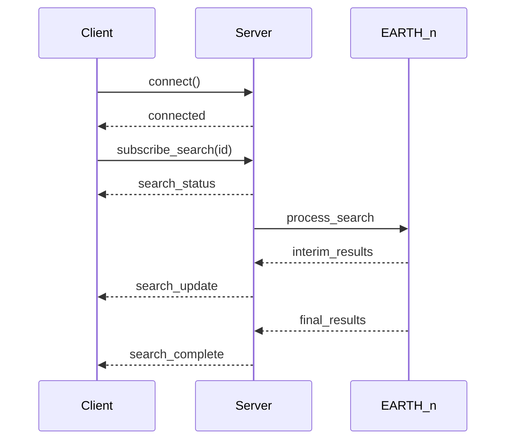
```mermaid
sequenceDiagram
    participant Client
    participant Server
    participant EARTH_n
    
    Client->>Server: connect()
    Server-->>Client: connected
    
    Client->>Server: subscribe_search(id)
    Server-->>Client: search_status
    
    Server->>EARTH_n: process_search
    EARTH_n-->>Server: interim_results
    Server-->>Client: search_update
    
    EARTH_n-->>Server: final_results
    Server-->>Client: search_complete
```

### 5.3.3 Integration Interfaces

| Service | Protocol | Authentication | Rate Limits |
|---------|----------|----------------|-------------|
| EARTH-n | REST/WebSocket | JWT | 100 req/min |
| Mapbox | HTTPS | API Key | 500 req/min |
| Auth Service | OAuth 2.0 | Client Credentials | 1000 req/min |
| CRM | REST | API Key | 50 req/min |

### 5.3.4 Error Handling

| Error Category | HTTP Status | Response Format |
|----------------|-------------|-----------------|
| Validation | 400 | `{"error": "details", "fields": [...]}` |
| Authentication | 401 | `{"error": "message"}` |
| Authorization | 403 | `{"error": "message"}` |
| Resource | 404 | `{"error": "message"}` |
| Server | 500 | `{"error": "message", "id": "trace_id"}` |

# 6. USER INTERFACE DESIGN

## 6.1 Interface Components Key

```
Icons:
[?] - Help/Information tooltip
[$] - Payment/Pricing related
[i] - Information display
[+] - Add new item
[x] - Close/Remove item
[<] [>] - Navigation controls
[^] - Upload functionality
[#] - Menu/Dashboard
[@] - User profile
[!] - Alert/Warning
[=] - Settings menu
[*] - Favorite/Important

Input Elements:
[ ] - Checkbox
( ) - Radio button
[...] - Text input field
[v] - Dropdown menu
[Button] - Clickable button
[====] - Progress indicator

Containers:
+--+ - Container border
|  | - Container sides
+-- - Hierarchical relationship
```

## 6.2 Main Dashboard Layout

```
+--------------------------------------------------------+
|  [#] Matter Platform    [@]Profile  [?]Help  [=]Settings |
+--------------------------------------------------------+
|                                                         |
|  +------------------+  +-----------------------------+  |
|  |  Search History  |  |        Active Map View      |  |
|  |  [*] Search #1   |  |                            |  |
|  |  [ ] Search #2   |  |     [Interactive Mapbox    |  |
|  |  [ ] Search #3   |  |        GL JS Region]       |  |
|  |                  |  |                            |  |
|  |  [+] New Search  |  |     [<] Zoom [>]          |  |
|  +------------------+  +-----------------------------+  |
|                                                         |
|  +------------------+  +-----------------------------+  |
|  | Recent Activity  |  |     Search Parameters      |  |
|  | - Asset Update   |  | Location: [...]            |  |
|  | - Search Complete|  | Asset Type: [v]            |  |
|  | - New Alert     !|  | Requirements: [...]        |  |
|  +------------------+  |                            |  |
|                       | [Search] [Save Draft]       |  |
|                       +-----------------------------+  |
+--------------------------------------------------------+
```

## 6.3 Location Input Interface

```
+--------------------------------------------------------+
|                    Location Definition                   |
+--------------------------------------------------------+
|                                                         |
|  +------------------+  +-----------------------------+  |
|  | Input Method     |  |                            |  |
|  | ( ) Draw on Map  |  |     Interactive Map        |  |
|  | ( ) Upload KML   |  |     Drawing Region         |  |
|  | ( ) Coordinates  |  |                            |  |
|  |                  |  |  [Click to start drawing]  |  |
|  | [^] Upload File  |  |                            |  |
|  +------------------+  +-----------------------------+  |
|                                                         |
|  +------------------------------------------------+   |
|  | Coordinate Input                                |   |
|  | Latitude:  [...] Longitude: [...]              |   |
|  | Radius:    [...] km                            |   |
|  |                                                |   |
|  | [Validate] [Clear]                            |   |
|  +------------------------------------------------+   |
|                                                         |
|  [< Back]                          [Continue >]        |
+--------------------------------------------------------+
```

## 6.4 Asset Definition Interface

```
+--------------------------------------------------------+
|                    Asset Definition                      |
+--------------------------------------------------------+
|                                                         |
|  +--------------------------------------------------+  |
|  | Asset Type Selection                              |  |
|  | [v] Select Primary Asset Type                     |  |
|  |     - Environmental Monitoring                    |  |
|  |     - Infrastructure                             |  |
|  |     - Agriculture                                |  |
|  |     - Custom                                     |  |
|  +--------------------------------------------------+  |
|                                                         |
|  +--------------------------------------------------+  |
|  | Detection Parameters                              |  |
|  | Minimum Size:    [...] meters                     |  |
|  | Detection Limit: [...] units [?]                  |  |
|  | Time Window:     [...] to [...]                   |  |
|  |                                                   |  |
|  | [ ] Include adjacent recommendations              |  |
|  +--------------------------------------------------+  |
|                                                         |
|  [< Back]                          [Continue >]        |
+--------------------------------------------------------+
```

## 6.5 Results Dashboard

```
+--------------------------------------------------------+
|                    Search Results                        |
+--------------------------------------------------------+
|  [!] Optimizing collection parameters...  [====]  75%   |
|                                                         |
|  +------------------+  +-----------------------------+  |
|  | Collection       |  |      Capability Matrix      |  |
|  | Windows          |  |                            |  |
|  |                  |  | Asset     | Confidence     |  |
|  | May 15 09:00     |  | Type A    | [====] 95%    |  |
|  | May 16 14:30     |  | Type B    | [==  ] 45%    |  |
|  | May 17 11:15     |  | Type C    | [===] 75%    |  |
|  +------------------+  +-----------------------------+  |
|                                                         |
|  +--------------------------------------------------+  |
|  | Recommendations                                   |  |
|  | [*] Primary Collection: May 15 09:00             |  |
|  | [ ] Alternative: May 16 14:30                    |  |
|  |                                                  |  |
|  | [$] Estimated Cost: $2,500                       |  |
|  +--------------------------------------------------+  |
|                                                         |
|  [Export Results] [Save Search] [Contact Sales]        |
+--------------------------------------------------------+
```

## 6.6 Responsive Design Breakpoints

```
Desktop (>1200px)
+------------------+----------------------+
|     Sidebar      |    Main Content     |
|                  |                     |
+------------------+----------------------+

Tablet (768-1199px)
+----------------------------------+
|           Main Content           |
|                                 |
| [=] Collapsible Sidebar         |
+----------------------------------+

Mobile (<767px)
+----------------------------------+
|     [=] Menu                     |
+----------------------------------+
|         Main Content             |
|     (Stacked Components)         |
+----------------------------------+
```

## 6.7 Component States

```
Button States:
[Button]           - Normal
[Button]*          - Hover
[Button]#          - Active
[Button]_          - Disabled

Input States:
[...]             - Normal
[...]*            - Focus
[...]!            - Error
[...]_            - Disabled

Alert Types:
[!] Error:   +------------------+
             | Error message    |
             +------------------+

[i] Info:    +------------------+
             | Info message     |
             +------------------+

[?] Help:    +------------------+
             | Help text        |
             +------------------+
```

## 6.8 Navigation Flow

```
+----------------+     +----------------+     +----------------+
|    Login       | --> |   Dashboard   | --> | Location Input |
+----------------+     +----------------+     +----------------+
                                |                    |
                                v                    v
+----------------+     +----------------+     +----------------+
|    Results     | <-- |  Processing   | <-- | Asset Define   |
+----------------+     +----------------+     +----------------+
        |
        v
+----------------+     +----------------+
|  Save/Export   | --> |   Contact     |
+----------------+     +----------------+
```

# 7. SECURITY CONSIDERATIONS

## 7.1 AUTHENTICATION AND AUTHORIZATION

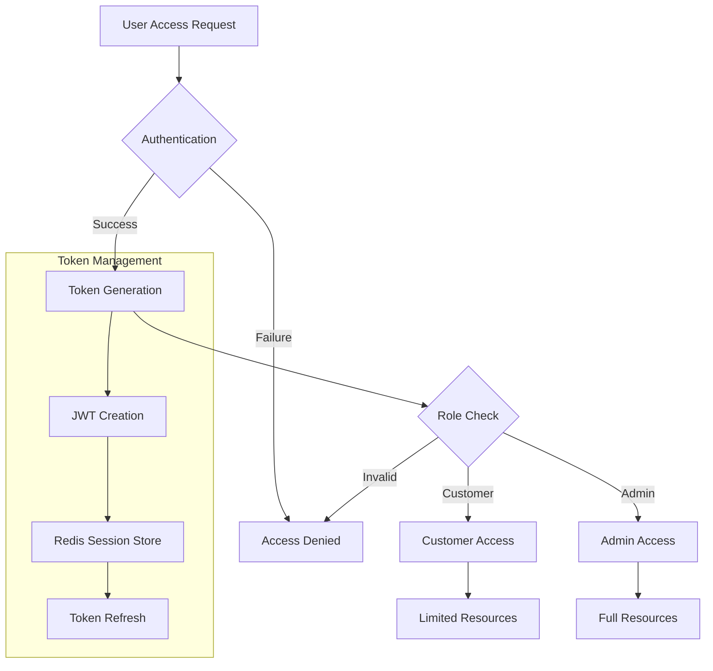
```mermaid
flowchart TD
    A[User Access Request] --> B{Authentication}
    B -->|Success| C[Token Generation]
    B -->|Failure| D[Access Denied]
    
    C --> E{Role Check}
    E -->|Customer| F[Customer Access]
    E -->|Admin| G[Admin Access]
    E -->|Invalid| D
    
    F --> H[Limited Resources]
    G --> I[Full Resources]
    
    subgraph Token Management
        C --> J[JWT Creation]
        J --> K[Redis Session Store]
        K --> L[Token Refresh]
    end
```

| Authentication Method | Implementation | Purpose |
|----------------------|----------------|----------|
| OAuth 2.0 | Auth0 Integration | Primary user authentication |
| JWT Tokens | RS256 Algorithm | Session management |
| MFA | Time-based OTP | Additional security layer |
| API Keys | SHA-256 Hashed | Service authentication |
| SSO | SAML 2.0 | Enterprise authentication |

### Role-Based Access Control (RBAC)

| Role | Permissions | Access Level |
|------|------------|--------------|
| Customer | - View own searches<br>- Create new searches<br>- Access basic reports | Standard |
| Admin | - View all searches<br>- Manage users<br>- Access system settings | Full |
| Service | - API access<br>- Data processing | Limited |

## 7.2 DATA SECURITY

### 7.2.1 Encryption Standards

| Data State | Method | Key Management |
|------------|--------|----------------|
| In Transit | TLS 1.3 | AWS Certificate Manager |
| At Rest | AES-256 | AWS KMS |
| Database | Field-level encryption | Hardware Security Module |
| Backups | AES-256 | Separate key hierarchy |

### 7.2.2 Data Classification

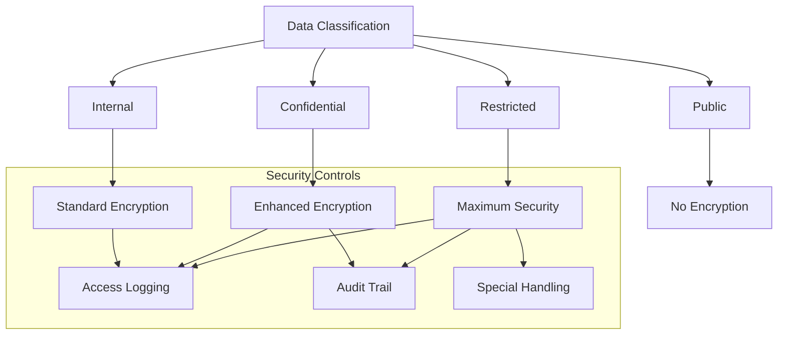
```mermaid
graph TD
    A[Data Classification] --> B[Public]
    A --> C[Internal]
    A --> D[Confidential]
    A --> E[Restricted]
    
    B --> F[No Encryption]
    C --> G[Standard Encryption]
    D --> H[Enhanced Encryption]
    E --> I[Maximum Security]
    
    subgraph Security Controls
        G --> J[Access Logging]
        H --> J
        I --> J
        H --> K[Audit Trail]
        I --> K
        I --> L[Special Handling]
    end
```

## 7.3 SECURITY PROTOCOLS

### 7.3.1 Network Security

| Layer | Protection Measure | Implementation |
|-------|-------------------|----------------|
| Edge | AWS WAF | DDoS protection, IP filtering |
| Application | ModSecurity | OWASP Top 10 protection |
| Transport | TLS 1.3 | Secure communication |
| Network | VPC | Network isolation |

### 7.3.2 Security Monitoring

```mermaid
flowchart LR
    A[Security Events] --> B{Event Processing}
    B --> C[CloudWatch]
    B --> D[ELK Stack]
    
    C --> E[Alerts]
    D --> F[Analysis]
    
    E --> G[Security Team]
    F --> G
    
    subgraph Response
        G --> H[Incident Response]
        H --> I[Remediation]
        I --> J[Documentation]
    end
```

### 7.3.3 Security Compliance

| Requirement | Implementation | Validation |
|-------------|----------------|------------|
| GDPR | - Data encryption<br>- Access controls<br>- Data deletion | Annual audit |
| SOC 2 | - Security monitoring<br>- Change management<br>- Access review | Quarterly review |
| ISO 27001 | - Security policies<br>- Risk assessment<br>- Security training | External audit |

### 7.3.4 Incident Response

| Phase | Actions | Responsibility |
|-------|---------|---------------|
| Detection | - Log analysis<br>- Alert monitoring<br>- User reports | Security team |
| Containment | - System isolation<br>- Access restriction<br>- Evidence preservation | Operations team |
| Eradication | - Threat removal<br>- System hardening<br>- Patch application | Security & DevOps |
| Recovery | - Service restoration<br>- Data validation<br>- System monitoring | Operations team |

### 7.3.5 Security Testing

| Test Type | Frequency | Tools |
|-----------|-----------|-------|
| Penetration Testing | Quarterly | Burp Suite, Metasploit |
| Vulnerability Scanning | Weekly | Nessus, OpenVAS |
| Code Analysis | Continuous | SonarQube, Checkmarx |
| Security Review | Monthly | Manual assessment |

# 8. INFRASTRUCTURE

## 8.1 DEPLOYMENT ENVIRONMENT

```mermaid
flowchart TD
    subgraph Production
        A[AWS Cloud] --> B[Primary Region]
        A --> C[DR Region]
        B --> D[VPC]
        C --> E[DR VPC]
    end
    
    subgraph Development
        F[Dev Environment] --> G[Staging]
        G --> H[QA]
    end
    
    subgraph Edge
        I[CloudFront] --> J[Global Edge Locations]
    end
    
    H --> A
```

| Environment | Purpose | Configuration |
|-------------|---------|---------------|
| Development | Feature development and testing | Single region, reduced resources |
| Staging | Pre-production validation | Production mirror with reduced capacity |
| Production | Live system operation | Multi-region, full HA configuration |
| DR | Disaster recovery | Hot standby with replication |

## 8.2 CLOUD SERVICES

| Service | Usage | Justification |
|---------|-------|---------------|
| AWS EKS | Container orchestration | Native K8s integration, managed control plane |
| AWS RDS | PostgreSQL database | Managed service, automated backups, Multi-AZ |
| AWS ElastiCache | Redis caching | Managed Redis, cluster mode, auto-failover |
| AWS S3 | Object storage | Scalable storage for KML files and exports |
| CloudFront | CDN | Global edge network, low latency content delivery |
| Route 53 | DNS management | Global DNS with health checks and failover |
| AWS WAF | Web application firewall | DDoS protection, security rules |

## 8.3 CONTAINERIZATION

```mermaid
graph TD
    subgraph Container Architecture
        A[Base Images] --> B[Service Images]
        B --> C[Runtime Containers]
        
        D[Configuration] --> C
        E[Secrets] --> C
    end
    
    subgraph Image Layers
        F[OS Base] --> G[Runtime]
        G --> H[Dependencies]
        H --> I[Application]
    end
```

| Component | Implementation | Configuration |
|-----------|----------------|---------------|
| Base Image | Alpine Linux | Minimal secure base OS |
| Runtime | Node.js 18 LTS, Python 3.11 | Language-specific official images |
| Build Process | Multi-stage builds | Optimized for size and security |
| Registry | AWS ECR | Private container registry |
| Security | Vulnerability scanning | Automated image scanning |

## 8.4 ORCHESTRATION

```mermaid
graph TD
    subgraph EKS Cluster
        A[Control Plane] --> B[Node Groups]
        B --> C[Web Pods]
        B --> D[Service Pods]
        B --> E[Worker Pods]
    end
    
    subgraph Services
        F[Service Mesh] --> G[Load Balancer]
        G --> H[Ingress Controller]
        H --> I[Pod Network]
    end
```

| Component | Configuration | Purpose |
|-----------|---------------|----------|
| EKS Cluster | v1.25+ | Kubernetes orchestration |
| Node Groups | Auto-scaling | Dynamic resource allocation |
| Service Mesh | Istio | Traffic management, security |
| Monitoring | Prometheus/Grafana | Cluster and application monitoring |
| Secrets | AWS Secrets Manager | Secure configuration management |

## 8.5 CI/CD PIPELINE

```mermaid
flowchart LR
    A[Source] --> B[Build]
    B --> C[Test]
    C --> D[Security Scan]
    D --> E[Deploy Staging]
    E --> F[Integration Tests]
    F --> G[Deploy Production]
    
    subgraph Automation
        H[GitHub Actions] --> I[AWS CodePipeline]
        I --> J[ArgoCD]
    end
```

| Stage | Tools | Purpose |
|-------|-------|----------|
| Source Control | GitHub | Version control, code review |
| CI Pipeline | GitHub Actions | Automated builds, tests |
| Artifact Storage | AWS ECR, S3 | Image and asset storage |
| CD Pipeline | ArgoCD | GitOps deployment |
| Monitoring | New Relic | Deployment monitoring |
| Security | Snyk, SonarQube | Security scanning |

### Deployment Process

| Phase | Actions | Validation |
|-------|---------|------------|
| Build | Compile code, create containers | Unit tests, linting |
| Test | Run automated tests | Integration tests, security scans |
| Stage | Deploy to staging | Smoke tests, performance tests |
| Production | Blue-green deployment | Health checks, monitoring |
| Rollback | Automated fallback | Failure detection, recovery |

# APPENDICES

## A.1 Additional Technical Information

### A.1.1 Browser Compatibility Matrix

| Browser | Minimum Version | Supported Features |
|---------|----------------|-------------------|
| Chrome | 90+ | Full functionality |
| Firefox | 88+ | Full functionality |
| Safari | 14+ | Full functionality except WebGL performance optimizations |
| Edge | 90+ | Full functionality |
| Opera | 76+ | Full functionality |

### A.1.2 Error Code Reference

| Code Range | Category | Handling |
|------------|----------|----------|
| 1000-1999 | Authentication | User notification with retry option |
| 2000-2999 | Location Processing | Validation feedback with correction guidance |
| 3000-3999 | Asset Definition | Parameter adjustment suggestions |
| 4000-4999 | EARTH-n Integration | Automatic retry with exponential backoff |
| 5000-5999 | System Errors | Admin notification and fallback modes |

### A.1.3 Data Flow Architecture

```mermaid
flowchart TD
    A[Client Browser] --> B[CDN]
    B --> C[Load Balancer]
    C --> D[Web Application]
    D --> E[API Gateway]
    
    E --> F[Auth Service]
    E --> G[Search Service]
    E --> H[Planning Service]
    
    F --> I[(User DB)]
    G --> J[(Spatial DB)]
    H --> K[EARTH-n]
    
    L[(Redis Cache)] --> F
    L --> G
    L --> H
```

## A.2 GLOSSARY

| Term | Definition |
|------|------------|
| Adjacent Application | Secondary use cases identified for satellite data products |
| Blue-Green Deployment | Deployment strategy using two identical environments for zero-downtime updates |
| Collection Optimization | Process of determining optimal satellite imaging parameters |
| Detection Limit | Minimum observable quantity or size for a given asset type |
| EARTH-n | Matter's proprietary satellite collection planning simulator |
| Geocoding | Process of converting addresses into geographic coordinates |
| Imaging Parameters | Specific settings for satellite sensors during data collection |
| KML | File format for displaying geographic data |
| Multi-AZ | Deployment across multiple availability zones for redundancy |
| PostGIS | Spatial database extension for PostgreSQL |
| Swath Width | Maximum width of area covered in single satellite pass |
| WebGL | Web Graphics Library for rendering interactive 3D/2D graphics |

## A.3 ACRONYMS

| Acronym | Full Form |
|---------|-----------|
| API | Application Programming Interface |
| AWS | Amazon Web Services |
| CDN | Content Delivery Network |
| CRM | Customer Relationship Management |
| CTA | Call To Action |
| GDPR | General Data Protection Regulation |
| HA | High Availability |
| IaC | Infrastructure as Code |
| JWT | JSON Web Token |
| KML | Keyhole Markup Language |
| MDL | Minimum Detection Limit |
| MFA | Multi-Factor Authentication |
| MTBF | Mean Time Between Failures |
| MTTR | Mean Time To Recovery |
| PII | Personally Identifiable Information |
| RBAC | Role-Based Access Control |
| REST | Representational State Transfer |
| SDK | Software Development Kit |
| SLA | Service Level Agreement |
| SOC | System and Organization Controls |
| SSL | Secure Sockets Layer |
| SSO | Single Sign-On |
| TLS | Transport Layer Security |
| UI | User Interface |
| UX | User Experience |
| VPC | Virtual Private Cloud |
| WAF | Web Application Firewall |
| WCAG | Web Content Accessibility Guidelines |
| WSS | WebSocket Secure |
| XSS | Cross-Site Scripting |