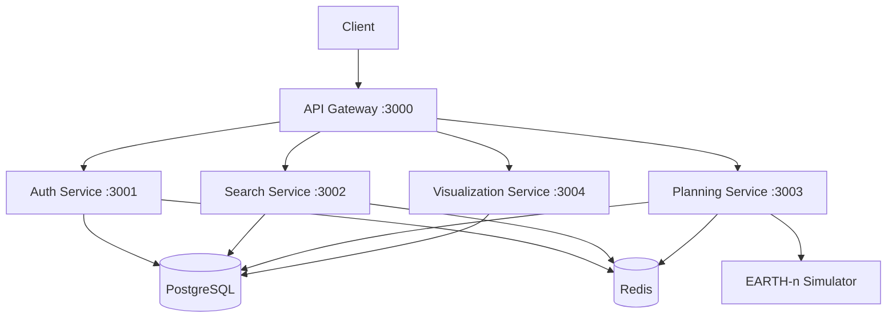

# Matter Platform Backend

Enterprise-grade microservices architecture for Matter's satellite data product matching platform.

## Overview

The Matter Platform backend implements a scalable microservices architecture that enables customers to define, visualize, and plan Earth observation requirements by matching their specific needs with Matter's satellite capabilities.

### Architecture Diagram



### Technology Stack

- **Runtime Environments**
  - Node.js v18 LTS (TypeScript services)
  - Python 3.11+ (Specialized services)

- **Databases**
  - PostgreSQL 14 with PostGIS
  - Redis 7 for caching

- **Infrastructure**
  - Docker 20+
  - Kubernetes 1.25+

## Prerequisites

1. Development Tools
   - Node.js 18 LTS
   - Python 3.11+
   - Docker 20+ and Docker Compose
   - kubectl for Kubernetes interaction

2. Database Systems
   - PostgreSQL 14 with PostGIS extension
   - Redis 7

3. Cloud Provider Access
   - AWS CLI configured with appropriate permissions
   - kubectl configured for EKS cluster access

## Project Structure

```
src/backend/
├── services/
│   ├── api-gateway/        # API Gateway service (Node.js/TS)
│   ├── auth-service/       # Authentication service (Node.js/TS)
│   ├── search-service/     # Search processing service (Python)
│   ├── planning-service/   # Collection planning service (Python)
│   └── viz-service/        # Visualization service (Node.js/TS)
├── libs/
│   ├── common/            # Shared utilities and types
│   └── database/          # Database schemas and migrations
├── deploy/
│   ├── kubernetes/        # K8s manifests
│   └── terraform/         # Infrastructure as Code
├── docker/
│   └── */                 # Service-specific Dockerfiles
├── scripts/
│   └── */                 # Development and deployment scripts
├── docker-compose.yml     # Local development orchestration
├── package.json          # Project configuration
└── .env.example          # Environment variable template
```

## Getting Started

1. Clone the repository and install dependencies:
```bash
git clone <repository-url>
cd src/backend
npm install
```

2. Configure environment variables:
```bash
cp .env.example .env
# Edit .env with appropriate values
```

3. Start development environment:
```bash
docker-compose up
```

## Development

### Service Ports

- API Gateway: 3000
- Auth Service: 3001
- Search Service: 3002
- Planning Service: 3003
- Visualization Service: 3004

### Common Commands

```bash
# Install dependencies
npm install

# Build all services
npm run build

# Run tests
npm run test

# Start development environment
docker-compose up

# Lint code
npm run lint

# Run database migrations
npm run migrate
```

### Development Guidelines

1. Code Style
   - Follow TypeScript/Python style guides
   - Use ESLint/Pylint for linting
   - Maintain consistent documentation

2. Testing
   - Write unit tests for all new features
   - Maintain integration test coverage
   - Run end-to-end tests before deployment

3. Git Workflow
   - Feature branches from develop
   - Pull request reviews required
   - Squash merge to maintain clean history

## Deployment

### Environment Configuration

1. Development
   - Local Docker Compose environment
   - Hot reloading enabled
   - Debug logging active

2. Staging
   - EKS deployment with reduced resources
   - Staging database instances
   - Integration testing environment

3. Production
   - Multi-AZ EKS deployment
   - Production database clusters
   - Full monitoring and alerting

### Deployment Process

```bash
# Build production images
docker-compose -f docker-compose.prod.yml build

# Deploy to Kubernetes
kubectl apply -f deploy/kubernetes/

# Run database migrations
npm run migrate:prod
```

## API Documentation

Detailed API documentation is available at:
- Development: http://localhost:3000/docs
- Staging: https://api.staging.matter.com/docs
- Production: https://api.matter.com/docs

## Security

1. Authentication
   - OAuth 2.0 with JWT
   - Role-based access control
   - MFA for administrative access

2. Data Protection
   - TLS 1.3 for all communications
   - Data encryption at rest
   - Regular security audits

3. Compliance
   - GDPR compliance measures
   - SOC 2 controls
   - Regular penetration testing

## Monitoring

1. Metrics
   - Prometheus for system metrics
   - Custom business metrics
   - SLA monitoring

2. Logging
   - ELK Stack integration
   - Structured logging format
   - Log retention policies

3. Alerting
   - PagerDuty integration
   - Alert severity levels
   - On-call rotation

## Troubleshooting

1. Common Issues
   - Database connection errors
   - Redis cache issues
   - Authentication failures

2. Debug Tools
   - Service logs: `docker-compose logs <service>`
   - Database console: `psql -U matter`
   - Redis CLI: `redis-cli`

## Contributing

1. Development Process
   - Fork the repository
   - Create feature branch
   - Submit pull request

2. Code Review
   - Required approvals: 2
   - CI checks must pass
   - Documentation updates required

3. Release Process
   - Version bump
   - Changelog update
   - Release notes

## License

Proprietary - All rights reserved